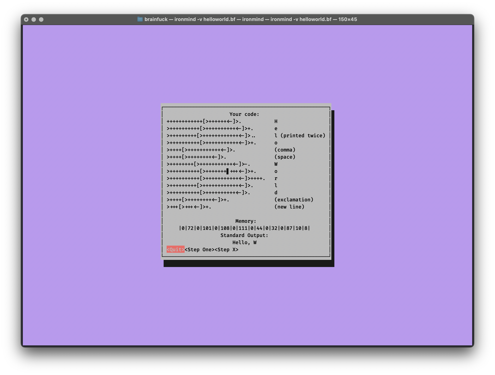

# The Iron Mind Interpreter
A BrainF*ck interpreter and code execution visualizer written in Rust

[](https://opensource.org/licenses/MIT)
[](https://crates.io/crates/ironmind)
[](https://github.com/Jadens-Arc/Ironmind)
[](https://snapcraft.io/ironmind)

[What is BrainF*ck](https://www.youtube.com/watch?v=hdHjjBS4cs8)

## Installation Instructions
### Cargo
`cargo install ironmind`

### Homebrew
First `brew tap jadens-arc/tap`

Then `brew install ironmind`

### Snapcraft
`snap install ironmind`


## Usage
Sample program:
```brainfuck
myfile.bf
++++++++++++[>++++++<-]>.           H
>++++++++++[>++++++++++<-]>+.       e
>+++++++++[>++++++++++++<-]>..      l (printed twice)
>++++++++++[>+++++++++++<-]>+.      o
>++++[>+++++++++++<-]>.             (comma)
>++++[>++++++++<-]>.                (space)
>++++++++[>+++++++++++<-]>-.        W
>++++++++++[>+++++++++++<-]>+.      o
>++++++++++[>+++++++++++<-]>++++.   r
>+++++++++[>++++++++++++<-]>.       l
>++++++++++[>++++++++++<-]>.        d
>++++[>++++++++<-]>+.               (exclamation)
>+++[>+++<-]>+.                     (new line)
```

### Run Program

```shell
ironmind myfile.bf
```
Output:
```
Hello, World!
```

### Visualize Execution

```shell
ironmind -v myfile.bf
```
Output:


## Build Instructions
### System Dependencies
- Rust
- Cargo

### Rust Dependencies (These install automatically)
- Clap for processing command line arguments and flags
- Cursive for TUI

### Build Notes
- Cursive is a wrapper around the ncurses linux library
  - If this library isn't present on your machine then it must be installed before ironmind can be built
  - On debian systems ncurses can be installed using ``` sudo apt install libncurses5-dev libncursesw5-dev ```

### Run for Debugging / Testing
```shell
git clone https://github.com/Jadens-arc/Ironmind
cd Ironmind
cargo run myfile.bf
```
To run automated tests run
```shell
cargo test
```
Tests are found in ```src/tests```

### Compiling Executable
```shell
git clone https://github.com/Jadens-arc/Ironmind
cd Ironmind
cargo build --release
```
The executable will be found at ```target/release/ironmind```

Run using ```./ironmind```

Feel free to move it to a ```Bin/``` directory if you want

If you do move it, you can use   ```ironmind myfile.bf``` anywhere on your system


Also, I found [this really cool](http://www.99-bottles-of-beer.net/language-brainfuck-101.html) BrainF*ck program from 2005 that outputs 99 Bottles of Beer by Andrew Paczkowski

Definitely worth checking out

